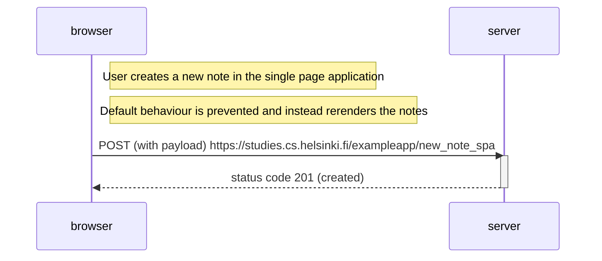

```mermaid
sequenceDiagram
    participant browser
    participant server

    Note right of browser: User creates a new note in the single page application
    Note right of browser: Default behaviour is prevented and instead rerenders the notes

    browser->>server: POST (with payload) https://studies.cs.helsinki.fi/exampleapp/new_note_spa
    activate server
    server-->>browser: status code 201 (created)
    deactivate server
```